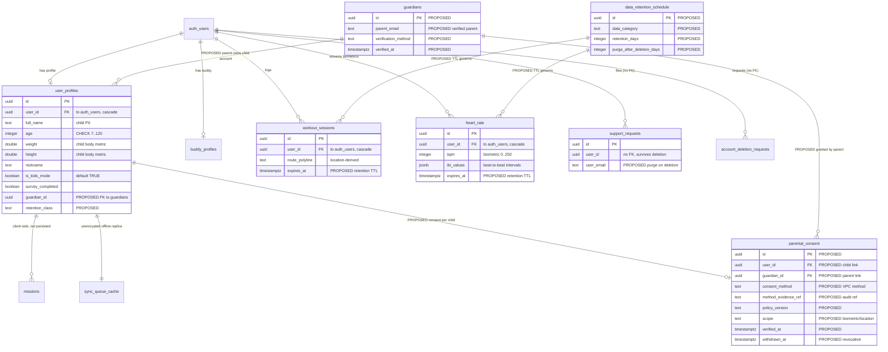

# FlowFit Five-Aspect Product Audit & Resolution — 2026-07-21

Five specialist teams (SEO, brand, legal, design, security) audited FlowFit in
parallel, then a synthesis lead consolidated the findings into this resolution
with an ERD-backed implementation plan.

> **Not legal advice.** The legal section is a *risk review and draft text*. It
> does **not** assert that FlowFit is or will be COPPA / GDPR / Google Play
> Families compliant. Every compliance *claim* is gated to counsel. The
> auto-implemented items are reviewable draft text and reversible code/meta/
> design edits only.

## 1. Executive summary

FlowFit is, by its own schema and marketing, a fitness app for **children aged
7–12** (`user_profiles.age` CHECK 7–120, `is_kids_mode` defaults TRUE, landing
"made friendly for kids") — yet only its *infrastructure* is built like a
children's product; its legal, consent, and privacy layers are not.

| Aspect | Health | Headline |
|---|---|---|
| **Security** | Strong backend, leaky client | Supabase RLS is airtight (every table row-scoped to `auth.uid()`, anon revoked, no `SECURITY DEFINER`, secrets clean). The real gaps are client-side: **release logging of biometrics + email**, and unencrypted child PII at rest with Android Auto Backup on. |
| **Legal** | Weakest layer, highest risk | A de-facto child-directed app with **no verifiable parental consent, no parent-held account, and zero children's-privacy language** in any live or in-app policy. |
| **SEO** | Bifurcated | Portfolio case study is strong; the two FlowFit-owned surfaces (apps-domain landing + triplicated Flutter SPA) lack robots/sitemap, JSON-LD, and canonicals. |
| **Brand** | Good system, drifted surfaces | The mascot is "Flowy" / "Buddy" / unnamed across three surfaces; audience reads as kids/generic/child-friendly depending on the page. |
| **Design** | Largely healthy | One shared WCAG-AA contrast failure on the primary CTA of both landings, a removed keyboard focus ring, and fabricated health metrics exposed to screen readers. |

**Two cross-cutting themes drive the plan:**

1. **Children's-data handling spans Legal + Security as one problem.** There is
   no consent entity, no retention schedule, biometrics/email are written to
   release logs, child PII sits unencrypted in SharedPreferences with Auto
   Backup on, and a deleted child's email survives in `support_requests`. The
   legal findings describe the missing *data model*; the security findings are
   how it leaks in practice.
2. **The FlowFit landing is a single artifact** (the
   `prepare_apps_domain_deploy.ps1` here-string in the sibling Pulse repo) that
   SEO, Brand, and Design all edit — one coordinated pass resolves ~15 findings.

**Order of attack:** (1) ship the client-side security logging + at-rest fixes
(a live leak, cheap, no decision needed); (2) draft the children's-privacy /
parental-acceptance / retention text (reviewable, counsel signs the *claim*);
(3) the coordinated landing + SPA copy/meta/a11y/contrast pass; (4) the SEO
crawl foundation; (5) escalate the human-gated architecture and legal decisions.

## 2. Data model (ERD): current + proposed

Proposed (children's-data governance) entities are marked `PROPOSED`.

## 3. Resolution — implemented autonomously (this session)

Reversible code/content/doc changes, each verified green. Legal text is
committed as **draft pending counsel** and asserts no compliance.

| # | Area | Change |
|---|---|---|
| C1 | Security | Strip child biometrics, email, and auth tokens from **release** logs (`Logger` no-op when `!kDebugMode`; gate the live-HR `debugPrint`; stop logging `user.email` and the raw auth-callback URI) |
| C2 | Security | `android:allowBackup="false"` so unencrypted child PII in SharedPreferences is not swept to cloud/adb |
| C3 | Legal (draft) | Add "Children's Privacy & Information for Parents" + "Eligibility / Parental Acceptance" sections; sync stale effective dates across all four policy surfaces |
| C4 | SEO+Brand | Canonical on `web/index.html` consolidating the three SPA copies; kids-tracker `<title>` + richer meta description |
| C5 | Design/a11y | AA CTA contrast (blue → blue-deep); `ExcludeSemantics` on the mock device preview (fake "72 BPM" no longer read as real); eyebrow letter-spacing |
| C6 | Brand+Legal docs | Flowy naming + terminology consistency; Families/COPPA checklist scaffold (decision-pending); `PRIVACY_DATA_MAP` kids posture |

Cross-repo (committed to non-production branches; **live deploy held for owner**):
the coordinated landing pass in the Pulse generator (robots/sitemap, JSON-LD,
canonical, parent-trust line, copy/a11y/contrast/focus-ring), and Flowy naming
in the portfolio case study.

## 4. Human-gated — requires you / counsel

These are **decisions or credential/deploy actions**, not mechanical edits.
Ready-to-hand-off drafts accompany each in the audit output.

**Legal / product decisions (counsel):**
- **LEGAL-01 Verifiable parental consent** — no VPC today; child self-checks a box. Needs a parent-held-account flow + `parental_consent`/`guardians` tables, and counsel must choose the COPPA §312.5 / GDPR Art.8 VPC method.
- **LEGAL-04 Special-category minimization** — HR/IBI biometrics + precise location + body metrics from under-13s; counsel on GDPR Art.9 / BIPA / COPPA + a product call on which sensors to keep for children.
- **BRAND-03 / LEGAL-05 Audience determination** — "directed to children" vs "kid-friendly, marketed to parents." Gates landing tone, store copy, and Families/Kids-Category enrollment.
- **LEGAL-06 Neutral pre-collection age gate**, **LEGAL-07 retention durations** (must be *chosen* before text can state them), **LEGAL-08 parent access/review/export/revoke path**, **LEGAL-09 auditable consent record**.
- **SEC-06** — deleted child's email persists in `support_requests`: purge vs anonymize vs retain (decision), then an RPC migration.

**Owner credential / deploy actions:**
- **SEC-05** rotate the weak Supabase DB password (dashboard).
- **SEC-04** move auth callback to a verified https App Link (host `assetlinks.json`).
- Live public deploy of the landing/policies + submitting the sitemap in Search Console.
- Apply the kids-mode DB migration (`supabase db push`).

**Design / brand decisions:**
- **DESIGN-03** app-wide primary-blue repaint (changes the documented brand color everywhere).
- **DESIGN-04/06/10** reconcile the two landing design languages / border contrast / dark-mode.
- **SEO-05** produce a real 1200×630 social card (design deliverable).
- **BRAND-07** canonical tagline + fitness-vs-wellness lead; **BRAND-11** confirm the canonical public repo.

## 5. Traceability

Full per-finding evidence (file:line / URL), recommendations, and the complete
45-item ranked plan are in the audit run output. Finding IDs (SEO-0x, BRAND-0x,
LEGAL-0x, DESIGN-0x, SEC-0x) are referenced throughout this document.
